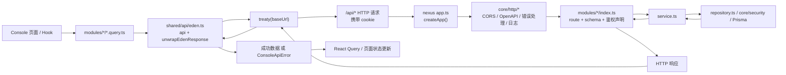

# Eden 指南

## 这份文档说明什么

这份文档用于说明当前仓库里 Eden 的接入方式、前后端如何通过 Eden 交互，以及后续新增接口或排查问题时应该改哪些文件、按什么顺序检查。

当前项目里的 Eden 主要用于两件事：

- 给 `packages/console` 提供基于 Elysia route 类型推导出来的 Treaty 客户端
- 给 `packages/nexus` 提供 smoke test，用同一套类型直接检查接口和登录态流程

如果你要继续开发前后端联调，先看这份文档，再看 [development.md](./development.md) 和 [api.md](./api.md)。

## Eden 放在哪里

当前仓库里和 Eden 直接相关的文件主要有这些：

### 服务端

- `packages/nexus/src/app.ts`
  - 创建 Elysia app，并挂载全部模块
- `packages/nexus/src/public/eden.ts`
  - 导出 `type App = typeof app`
- `packages/nexus/src/eden/index.ts`
  - 在源码目录里再导出 Eden 类型
- `packages/nexus/package.json`
  - 通过 `./eden` 导出给其他包引用
- `packages/nexus/src/eden/eden-smoke.test.ts`
  - 用 Eden Treaty 直接检查认证、用户和权限接口

### 前端

- `packages/console/src/shared/api/eden.ts`
  - 创建共享 Treaty 客户端
  - 统一处理 API 基址、cookie、错误拆包
- `packages/console/src/shared/api/index.ts`
  - 聚合导出 `api`、`resolveApiUrl(...)`、`unwrapEdenResponse(...)`
- `packages/console/src/modules/auth/auth.query.ts`
  - 登录方式、session、邮箱登录、登出
- `packages/console/src/modules/user/user.query.ts`
  - 用户列表、用户详情、我的资料
- `packages/console/src/modules/rbac/rbac.query.ts`
  - 角色、用户角色、用户权限

## 项目里怎么使用 Eden

### 1. 服务端只导出类型，不单独生成客户端代码

Eden 类型入口统一在 `packages/nexus/src/public/eden.ts` 维护：

```ts
import type { app } from '../app'

export type App = typeof app
```

这里直接从 `app` 推导类型，所以只要 `packages/nexus/src/app.ts` 里挂载的模块发生变化，前端 Treaty 客户端的路径和入参、返回值类型就会跟着变化，不需要额外生成代码。

### 2. 前端通过 `treaty<App>(...)` 创建共享客户端

`packages/console/src/shared/api/eden.ts` 会统一创建 Treaty 客户端：

```ts
const edenClient = treaty<App>(resolveConfiguredApiBaseUrl(), {
  fetch: {
    credentials: 'include',
  },
  throwHttpError: false,
})

export const api = edenClient.api
```

这里的几个关键点：

- 基址统一通过 `resolveConfiguredApiBaseUrl()` 处理
- 请求默认带 `credentials: 'include'`
  - 这样 `/api/auth/sign-in/email`、`/api/auth/get-session`、`/api/auth/sign-out` 这类依赖 session cookie 的接口可以正常工作
- `throwHttpError: false`
  - Treaty 返回 `{ data, error, status, response }`
  - 项目再通过 `unwrapEdenResponse(...)` 统一转成 `ConsoleApiError`

### 3. 页面不直接写 fetch，统一走 `api`

当前 `packages/console` 里的 query / mutation 都直接使用 `api`：

- `api.auth.methods.get()`
- `api.auth['get-session'].get()`
- `api.auth['sign-in'].email.post(payload)`
- `api.user.get({ query })`
- `api.user({ id }).patch(body)`
- `api.rbac.users({ userId }).roles.post(body)`

也就是说，页面开发时通常不需要再写一层和接口一一对应的 wrapper，直接在模块 query 文件里组合 Eden 调用和 React Query 即可。

### 4. GitHub 登录是当前实现里的例外

虽然认证模块的大部分 JSON 接口都走 Eden Treaty，但 GitHub 登录不是普通的 JSON 请求。

当前实现里：

- 前端通过 `getGithubSignInUrl(callbackURL)` 生成浏览器可直接访问的地址
- 浏览器跳转到 `/api/auth/sign-in/github`
- 服务端返回 `302`
- GitHub 回调到 `/api/auth/callback/github`
- 服务端建立 session 后再 `302` 回前端页面

这条流程仍然依赖浏览器重定向，不经过 `api.auth['sign-in'].github.get()` 这种 Treaty 请求封装。

## 前后端 Eden 交互流程

下面这张图对应当前项目里最常见的 Eden 请求流程，比如获取 session、用户列表、角色列表、更新资料这类接口。



如果是动态路由，Treaty 用函数写法传 path params，例如：

```ts
await api.user({ id }).get()
await api.rbac.users({ userId }).roles({ roleId }).delete()
```

如果是 query 参数，Treaty 继续放在请求配置里，例如：

```ts
await api.user.get({
  query: {
    page: 1,
    pageSize: 20,
    keyword: 'xdd',
  },
})
```

## 新增或修改接口时怎么接 Eden

### 场景一：只改 `packages/nexus`

如果你新增或调整了接口，推荐按下面顺序处理：

1. 改 `packages/nexus/src/modules/<name>/model.ts`
   - 定义 body / query / params / response schema
2. 改 `service.ts` 和 `repository.ts`
   - 写业务逻辑和数据库访问
3. 改 `packages/nexus/src/modules/<name>/index.ts`
   - 注册 route
   - 挂上 schema、鉴权和 `apiDetail(...)`
4. 确认模块已经通过 `packages/nexus/src/modules/index.ts` 挂到 `app`
5. 执行回归检查

只要 route 已经挂到 `app`，`App = typeof app` 的类型就会跟着更新。正常情况下不需要手动改 `packages/nexus/src/public/eden.ts`。

### 场景二：接口改完后要给 Console 页面使用

如果前端页面也要接这条接口，继续做下面几步：

1. 在对应模块的 query 文件里接入 `api`
   - 例如 `packages/console/src/modules/user/user.query.ts`
2. 用 `unwrapEdenResponse(...)` 统一拆包
3. 按页面需要补 `queryKey`、`queryOptions`、`useMutation`
4. 如果页面需要单独引用 HTTP 类型，再补 `packages/nexus/src/public/*-types.ts`

这里有一个区分：

- 如果只是通过 Eden 调接口，很多时候直接靠 Treaty 推导就够了
- 如果前端表单、表格、页面 props 需要复用明确的 HTTP 类型，再从 `@xdd-zone/nexus/auth-types`、`@xdd-zone/nexus/user-types`、`@xdd-zone/nexus/rbac-types`、`@xdd-zone/nexus/post-types`、`@xdd-zone/nexus/media-types`、`@xdd-zone/nexus/comment-types`、`@xdd-zone/nexus/site-config-types` 引入

### 场景三：需要新增一个新的业务模块

推荐动作：

1. 在 `packages/nexus/src/modules/<feature>/` 下建立模块目录
2. 写 `index.ts`、`model.ts`、`service.ts`
3. 按需补 `repository.ts`、`constants.ts`、`types.ts`
4. 在 `packages/nexus/src/modules/index.ts` 里 `.use(...)` 新模块
5. 如果 Console 需要接入，在对应 `packages/console/src/modules/<feature>/` 下补 query / mutation
6. 如果页面会复用独立 HTTP 类型，再补 `packages/nexus/src/public/*-types.ts`

## API 基址和 cookie 怎么维护

`packages/console/src/shared/api/eden.ts` 当前把基址处理集中在一个地方，后续如果切环境或改代理，优先看这里。

### 基址规则

基址读取顺序是：

1. `VITE_API_ORIGIN`
2. `VITE_API_ROOT`
3. `VITE_API_BASE_URL`

处理规则：

- 推荐直接传源站，例如 `http://localhost:7788`
- 如果传成 `http://localhost:7788/api`，代码会去掉结尾的 `/api`，避免再拼出 `/api/api`
- 如果没传环境变量，浏览器侧默认回退到当前页面 origin

### 本地开发代理

`packages/console/vite.config.ts` 当前把 `/api` 代理到：

- `VITE_API_PROXY_TARGET`
- 默认值 `http://localhost:7788`

所以本地开发最常见的两种方式是：

- 前端直接通过代理访问 `/api`
- 显式把 Eden 基址设到 Nexus 源站

### cookie 要求

因为当前认证依赖 session cookie，所以要同时保证下面几件事：

- Console Treaty 请求保留 `credentials: 'include'`
- Nexus CORS 允许 `credentials: true`
- `packages/nexus/config.yaml` 的 `trustedOrigins` 包含当前 Console 来源

如果这三处有一处不对，常见现象就是：

- 登录成功后 `/api/auth/get-session` 仍然拿不到用户
- 页面刷新后会话丢失
- 明明登录了，但 Eden 请求一直返回 `401`

## Eden smoke test 在这里做什么

`packages/nexus/src/eden/eden-smoke.test.ts` 当前主要验证这些内容：

- 通过 Treaty 直接调用 `createApp()` 生成的接口
- 匿名请求和带 cookie 的请求是否符合预期
- 邮箱注册、登录、session 查询是否能通
- 用户资料、角色、权限相关接口是否能通

这份测试里专门做了两种 fetcher：

- `directFetcher`
  - 直接把请求交给 `app.handle(...)`
- `createCookieFetcher()`
  - 手动保存和回放 cookie，模拟已登录请求

这也是当前项目里排查 Eden 或登录态问题最直接的测试入口之一。

## 后续开发建议

### 后端开发

- 新接口先把 `model.ts` 写完整，再去接 service 和 route
- route 一定挂到 `app`，否则 Eden 看不到这条路径
- 需要给前端单独复用类型时，再补 `src/public/*-types.ts`
- 涉及认证和权限时，优先复用 `authPlugin`、`accessPlugin`、`auth: 'required'`、`permission`、`me`、`own`

### 前端开发

- 页面请求统一从 `packages/console/src/shared/api/eden.ts` 导出的 `api` 开始
- 统一用 `unwrapEdenResponse(...)` 处理返回值
- query / mutation 写在模块目录，不要散落到页面里
- 直接浏览器跳转的流程单独处理，当前 GitHub 登录就是这种情况

### 文档和联调

- HTTP 路径、参数和 response 以模块 `model.ts` 和 `index.ts` 为准
- 人工查看接口说明时用 `/openapi` 和 `/openapi/json`
- 前后端联调时优先先看 Eden 类型能不能推出来，再看页面有没有正确接这条路径

## 维护检查清单

每次改完公共接口后，至少检查下面这些内容：

1. `bun run type-check`
2. `bun run lint`
3. `cd packages/nexus && bun test src/eden/eden-smoke.test.ts src/eden/openapi-smoke.test.ts`
4. 打开 `http://localhost:7788/openapi` 或 `http://localhost:7788/openapi/json`
5. 如果改了认证相关逻辑，再检查 `trustedOrigins`、cookie、前端 API 基址和 GitHub callback URL

如果问题出在前端联调，建议按下面顺序排查：

1. 看 `packages/console/src/shared/api/eden.ts` 的基址是不是正确
2. 看浏览器请求是否带上 cookie
3. 看服务端 route 是否已经挂到 `app`
4. 看返回的是 `401` 还是 `403`
5. 再决定去查认证、权限还是业务逻辑

## 什么时候需要改这些文件

### 改 `packages/nexus/src/public/eden.ts`

只在下面情况需要改：

- Eden 类型入口文件位置调整了
- `App` 类型不再直接来自 `app`

普通新增接口通常不需要动这里。

### 改 `packages/console/src/shared/api/eden.ts`

在下面情况需要改：

- API 基址规则变了
- cookie 或 fetch 配置要调整
- 统一错误处理要调整
- 项目想新增公共请求工具函数

### 改 `packages/nexus/src/public/*-types.ts`

在下面情况需要改：

- Console 要复用新的 HTTP 类型
- 某组模块的对外类型导出需要补充

如果只是 Eden 调用路径变化，而前端没有单独引用这些类型，可以先不改。

## 参考资料

- Elysia 官方 Eden 总览：[https://elysiajs.com/eden/overview](https://elysiajs.com/eden/overview)
- Elysia 官方 Eden Treaty 总览：[https://elysiajs.com/eden/treaty/overview](https://elysiajs.com/eden/treaty/overview)
- Elysia 官方 Eden Treaty 配置：[https://elysiajs.com/eden/treaty/config](https://elysiajs.com/eden/treaty/config)
- Elysia 官方 Eden Treaty 单元测试：[https://elysiajs.com/eden/treaty/unit-test](https://elysiajs.com/eden/treaty/unit-test)
